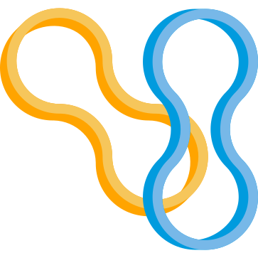

.. _api-doc:

.. toctree::
    :glob:

API Documentation
=================

.. automodule:: elastalk
    :members:
    :undoc-members:
    :show-inheritance:

elastalk.config
---------------

.. automodule:: elastalk.config
    :members:
    :undoc-members:
    :show-inheritance:

elastalk.connect
----------------

.. automodule:: elastalk.connect
    :members:
    :undoc-members:
    :show-inheritance:

elastalk.seed
-------------

.. automodule:: elastalk.seed
    :members:
    :undoc-members:
    :show-inheritance:

elastalk.version
----------------

.. automodule:: elastalk.version
    :members:
    :undoc-members:
    :show-inheritance: